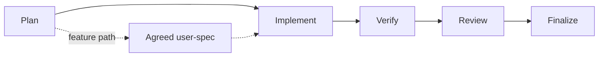

<div align="center">

# AI-First Development Framework

**Plan → approve → implement → verify → review → finalize, with agents.**

[](LICENSE) [](#what-runs-where) [](#install) [](#whats-inside) [](#whats-inside)

A compact, runtime-first workflow for building software with coding agents.
Fork of [molyanov-ai-dev](https://github.com/pavel-molyanov/molyanov-ai-dev).

</div>

---

## The methodology in one screen



| Step | Owning skill | Produces | Stops when |
|---|---|---|---|
| **Plan** | `user-spec-planning` | `work/{feature}/user-spec.md`, interview log, code research | the user approves the spec, after validation by `fw-uspec-quality`, `fw-uspec-adequacy`, `fw-skeptic` |
| **Implement** | `code-writing`, `layout-writing`, `infrastructure-setup`, `prompt-master`, `skill-master` | the agreed change only, checked at the smallest reliable boundary chosen by `test-master` | observable behavior matches the spec, and the verified state is committed |
| **Review** | `code-reviewing` + the fresh `fw-*` reviewers | evidence-gated findings per the shared [reviewer contract](skills/methodology/references/reviewer-contract.md) | no unaddressed material finding; corrections only when the request or spec authorizes them |
| **Finalize** | `documentation-writing` | updated Project Knowledge, feature moved to `work/completed/{feature}/` | Project Knowledge matches the code and the feature is archived |

**Three sources of truth.** The approved `user-spec.md` owns the agreed feature outcome; Project
Knowledge owns durable project facts; the code owns implementation detail. A finding is a diagnosis,
never a work queue — the orchestrator applies only an authorized correction.

**Three cross-cutting pieces.** `methodology` maps the process; `project-initialization` creates a
repository from the bundled template; `security-auditor` supplies review criteria for security work.

## Install

> [!NOTE]
> One-time, per-machine step. Nothing is recorded on disk — the source tree is the state, so a
> repeated `install` is the drift check.

```bash
git clone https://github.com/dsorrowt/dsw-ai-dev.git
cd dsw-ai-dev
python3 scripts/fw-install.py install               # copy skills/** and agents/fw-*.md
python3 scripts/fw-install.py uninstall --dry-run  # print the plan, change nothing
python3 scripts/fw-install.py uninstall            # delete the copies the sources describe
```

Copies land in `~/.agents/skills/` and `~/.omp/agent/agents/`; exit codes are `0` done, `2` refused
or failed, `3` nothing installed.

<details>
<summary><b>Safety contract</b></summary>

- `install` copies missing files and rewrites anything that differs from its source; it refuses
  before writing anything when a destination is a symlink, a directory, or sits behind a file.
- Writes go through a directory chain opened without following symlinks and land via `os.replace`,
  so a symlink swapped in mid-run cannot redirect them.
- `uninstall` deletes exactly the copies the sources describe, keeps content the plan does not name,
  and removes the directories below the managed roots that become empty. A re-run finishes an
  interrupted uninstall; a symlinked or unparsable source tree refuses the run.
- A copy whose source was deleted from the tree, and an edit to an installed copy, are not
  preserved: the next command replaces or removes them.
- No automatic backup. Optional insurance:
  `tar -C ~/.agents -czf ~/agents-skills-backup.tgz skills`.

</details>

## What's inside

**13 Agent Skills** — each owns its `SKILL.md`, optional `references/`, deterministic `scripts/`,
and output `assets/`, so packages stay portable instead of reaching into global directories.

| Area | Skills |
|---|---|
| Process | `methodology`, `project-initialization` |
| Planning | `user-spec-planning`, `documentation-writing` |
| Execution | `code-writing`, `layout-writing`, `infrastructure-setup`, `prompt-master`, `skill-master` |
| Quality | `test-master`, `code-reviewing`, `layout-reviewing`, `security-auditor` |

**15 agent wrappers** (`agents/fw-*.md`) — 14 reviewers and one researcher. A reviewer wrapper adds
fresh isolated context, a bounded skeptical role, and the minimum tools needed to inspect evidence;
`fw-code-researcher` instead gathers code evidence for planning and writes `code-research.md`. The
model of any wrapper comes from runtime configuration, never from the caller. All 14 reviewers read
one shared [reviewer contract](skills/methodology/references/reviewer-contract.md) — stance, result
schema, severity scale, review-wave ceiling, and findings rules live there once, and the contract
lists exactly those 14 roles.

### What runs where

| Capability | omp | pi | orca |
|---|---|---|---|
| Skills | `~/.agents/skills/` after install | same user location; project skills need trust | shares skill bundles |
| Agent layer | `~/.omp/agent/agents/` after install | no subagents | separate worker processes |
| Project context | `AGENTS.md` | `AGENTS.md`, no trust step | — |
| Orchestration | in-session `task` tool | orca worker required for fresh context | worktrees, terminals, handoffs |

**One step, one orchestrator.** Either the in-session `task` tool or an orca worker — never both:
neither runtime documents the semantics of mixing them.

<details>
<summary><b>Boundaries and limitations</b></summary>

- pi has no subagents; independent review and cross-runtime handoffs need an orca worker.
- Project `.agents/skills/` in pi requires a trust decision; omp wrappers need the global install.
- The optional template MCP config ships unpinned on purpose: review it and pin an exact package
  version before enabling it.
- Routing may name skills the runtime supplies (`code-review`, `update-skills`) rather than this
  repository.
- The local process documents under `work/` are git-ignored and are not part of the published fork.

</details>

## Repository map

```text
skills/       Agent Skills: process, planning, execution, quality
agents/       15 fw-* wrappers for omp: 14 reviewers + 1 code researcher
scripts/      fw-install.py — install and uninstall, no state file
AGENTS.md     Repository context: language, behavior, scope, worktrees, security
```

## License

MIT © 2024 [Pavel Molyanov](https://molyanov.ru) — upstream author of
[molyanov-ai-dev](https://github.com/pavel-molyanov/molyanov-ai-dev). Full text in [LICENSE](LICENSE).
